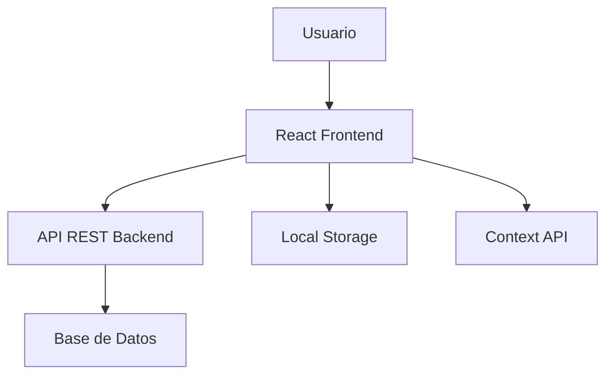

# Arquitectura del Sistema

## 🏗️ Vista General de la Arquitectura

### Patrón Arquitectónico: SPA (Single Page Application) con Separación Frontend/Backend



## 🎨 Frontend Architecture

### Stack Tecnológico
- **React 18**: Framework principal con Concurrent Features
- **TypeScript**: Tipado estático para mayor robustez
- **Vite**: Build tool optimizado para desarrollo rápido
- **Tailwind CSS**: Framework CSS utility-first
- **React Router**: Routing client-side
- **Context API**: State management global

### Estructura de Componentes
```
src/componentes/
├── layout/
│   └── Layout.tsx          # Layout principal con navegación
└── comunes/
    ├── Button.tsx          # Botón reutilizable
    ├── Input.tsx           # Input con validación
    ├── Modal.tsx           # Modal genérico
    ├── Card.tsx            # Card container
    ├── Badge.tsx           # Status badges
    └── Select.tsx          # Select dropdown
```

### Patrón de Composición
- **Container Components**: Manejan la lógica de negocio
- **Presentational Components**: Solo renderizado
- **Custom Hooks**: Lógica reutilizable
- **Context Providers**: Estado global

## 📁 Estructura de Archivos Detallada

### `/src/paginas/` - Páginas principales
```
paginas/
├── autenticacion/
│   └── LoginPage.tsx       # Página de login
├── administracion/
│   ├── DashboardPage.tsx   # Dashboard admin
│   ├── ClientsPage.tsx     # Gestión de clientes
│   └── VehiclesPage.tsx    # Gestión de vehículos
└── cliente/
    ├── ClientDashboardPage.tsx    # Dashboard cliente
    ├── ClientVehiclesPage.tsx     # Vehículos del cliente
    └── ClientAppointmentsPage.tsx # Citas del cliente
```

### `/src/contexto/` - Estado Global
```typescript
interface AppState {
  user: User | null;
  isAuthenticated: boolean;
  theme: 'light' | 'dark';
  loading: boolean;
}

interface AppContextType {
  state: AppState;
  dispatch: (action: AppAction) => void;
  login: (credentials: LoginCredentials) => Promise<void>;
  logout: () => void;
}
```

### `/src/tipos/` - Definiciones TypeScript
```typescript
// Interfaces principales del sistema
export interface User {
  id: string;
  email: string;
  role: 'admin' | 'client';
  name: string;
}

export interface Client {
  id: string;
  name: string;
  email: string;
  phone: string;
  address: string;
  createdAt: string;
}

export interface Vehicle {
  id: string;
  clientId: string;
  make: string;
  model: string;
  year: number;
  licensePlate: string;
  color: string;
  serviceType: string;
  mileage: number;
}
```

## 🔄 Flujo de Datos

### Patrón de Estado: Context + Reducer
```typescript
// Estado centralizado con Context API
const AppContext = createContext<AppContextType | undefined>(undefined);

// Reducer para manejo de acciones
function appReducer(state: AppState, action: AppAction): AppState {
  switch (action.type) {
    case 'LOGIN':
      return { ...state, user: action.payload, isAuthenticated: true };
    case 'LOGOUT':
      return { ...state, user: null, isAuthenticated: false };
    default:
      return state;
  }
}
```

### Persistencia Local
- **localStorage**: Sesión del usuario y preferencias
- **sessionStorage**: Datos temporales de formularios
- **Context API**: Estado en memoria durante la sesión

## 🛣️ Routing Strategy

### Rutas Protegidas
```typescript
// Componente de ruta protegida
function ProtectedRoute({ children, allowedRoles }: ProtectedRouteProps) {
  const { state } = useApp();
  
  if (!state.isAuthenticated) {
    return <Navigate to="/login" />;
  }
  
  if (allowedRoles && !allowedRoles.includes(state.user?.role)) {
    return <Navigate to="/unauthorized" />;
  }
  
  return children;
}
```

### Estructura de Rutas
```
/                         # Redirect to dashboard or login
/login                    # Página de autenticación
/dashboard               # Dashboard principal (admin)
/clients                 # Gestión de clientes (admin)
/vehicles               # Gestión de vehículos (admin)
/client-dashboard       # Dashboard del cliente
/client-vehicles        # Vehículos del cliente
/client-appointments    # Citas del cliente
```

## 🎯 Patterns y Mejores Prácticas

### Custom Hooks Pattern
```typescript
// Hook personalizado para autenticación
export function useAuth() {
  const context = useContext(AppContext);
  if (!context) {
    throw new Error('useAuth must be used within AppProvider');
  }
  return context;
}

// Hook para operaciones CRUD
export function useAPI<T>(endpoint: string) {
  const [data, setData] = useState<T[]>([]);
  const [loading, setLoading] = useState(false);
  
  const fetch = async () => { /* fetch logic */ };
  const create = async (item: T) => { /* create logic */ };
  const update = async (id: string, item: T) => { /* update logic */ };
  const remove = async (id: string) => { /* delete logic */ };
  
  return { data, loading, fetch, create, update, remove };
}
```

### Error Boundary Pattern
```typescript
interface ErrorBoundaryState {
  hasError: boolean;
  error?: Error;
}

class ErrorBoundary extends Component<Props, ErrorBoundaryState> {
  static getDerivedStateFromError(error: Error): ErrorBoundaryState {
    return { hasError: true, error };
  }
  
  render() {
    if (this.state.hasError) {
      return <ErrorFallback error={this.state.error} />;
    }
    return this.props.children;
  }
}
```

## 📱 Responsive Design Strategy

### Breakpoints Tailwind
```css
/* Mobile First Approach */
sm: '640px',   /* Tablet */
md: '768px',   /* Desktop small */
lg: '1024px',  /* Desktop */
xl: '1280px',  /* Desktop large */
2xl: '1536px'  /* Desktop extra large */
```

### Layout Responsivo
- **Mobile**: Stack vertical, menú hamburguesa
- **Tablet**: Grid 2 columnas, menú lateral colapsible  
- **Desktop**: Grid 3+ columnas, menú lateral fijo
- **Touch**: Botones mínimo 44px, gestos swipe

## 🔒 Security Architecture

### Autenticación JWT
```typescript
// Token storage y refresh automático
class AuthService {
  private token: string | null = null;
  
  setToken(token: string) {
    this.token = token;
    localStorage.setItem('auth_token', token);
  }
  
  getToken(): string | null {
    return this.token || localStorage.getItem('auth_token');
  }
  
  async refreshToken() {
    // Auto-refresh logic
  }
}
```

### Role-Based Access Control
```typescript
enum Roles {
  ADMIN = 'admin',
  CLIENT = 'client'
}

interface Permission {
  resource: string;
  actions: string[];
}

const ROLE_PERMISSIONS: Record<Roles, Permission[]> = {
  [Roles.ADMIN]: [
    { resource: 'clients', actions: ['create', 'read', 'update', 'delete'] },
    { resource: 'vehicles', actions: ['create', 'read', 'update', 'delete'] }
  ],
  [Roles.CLIENT]: [
    { resource: 'vehicles', actions: ['read'] },
    { resource: 'appointments', actions: ['create', 'read'] }
  ]
};
```

## ⚡ Performance Optimization

### Code Splitting
```typescript
// Lazy loading de páginas
const DashboardPage = lazy(() => import('../paginas/administracion/DashboardPage'));
const ClientsPage = lazy(() => import('../paginas/administracion/ClientsPage'));

// Suspense wrapper
<Suspense fallback={<LoadingSpinner />}>
  <DashboardPage />
</Suspense>
```

### Memoization Strategy
```typescript
// Memoización de componentes costosos
const ExpensiveComponent = memo(({ data }: Props) => {
  const processedData = useMemo(() => {
    return data.map(item => heavyProcessing(item));
  }, [data]);
  
  return <div>{processedData}</div>;
});
```

### Virtual Scrolling
Para listas grandes de clientes/vehículos:
```typescript
// Implementar react-window para listas > 100 items
import { FixedSizeList } from 'react-window';
```

## 🧪 Testing Strategy

### Pirámide de Testing
1. **Unit Tests**: Componentes individuales, hooks, utilities
2. **Integration Tests**: Flujos de usuario completos
3. **E2E Tests**: Scenarios críticos del negocio

### Testing Tools
- **Jest**: Test runner y assertions
- **React Testing Library**: Testing de componentes
- **MSW**: Mocking de API calls
- **Cypress**: E2E testing

## 📊 Monitoring y Analytics

### Error Tracking
```typescript
// Error boundary with logging
function logError(error: Error, errorInfo: ErrorInfo) {
  // Send to monitoring service (Sentry, LogRocket, etc.)
  console.error('Error capturado:', error, errorInfo);
}
```

### Performance Metrics
- **FCP**: First Contentful Paint < 1.5s
- **LCP**: Largest Contentful Paint < 2.5s
- **FID**: First Input Delay < 100ms
- **CLS**: Cumulative Layout Shift < 0.1

## 🔄 Future Scalability

### Micro-Frontends Preparation
- Arquitectura modular por feature
- Shared design system
- Independent deployments

### PWA Readiness
- Service Workers para offline
- Web App Manifest
- Push notifications
- Background sync

---

**Esta arquitectura está diseñada para:**
- Escalabilidad horizontal
- Mantenimiento a largo plazo
- Performance óptimo
- Experiencia de usuario superior
- Integración fácil con backend
